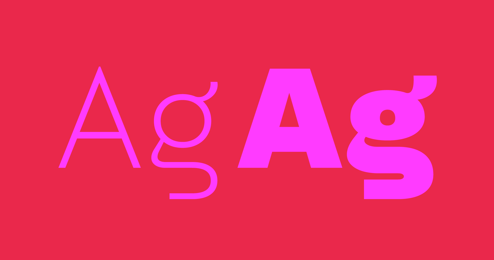
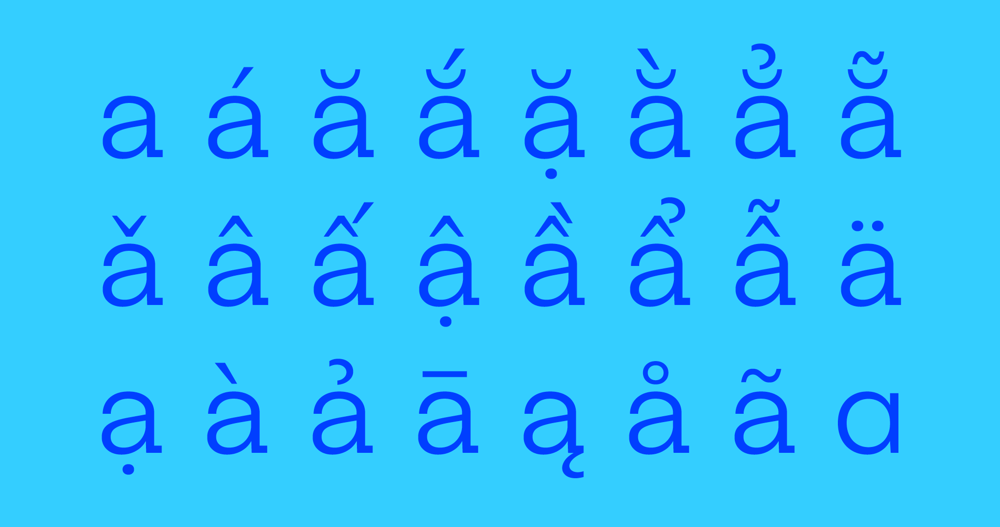
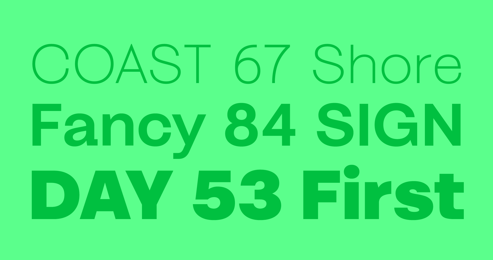
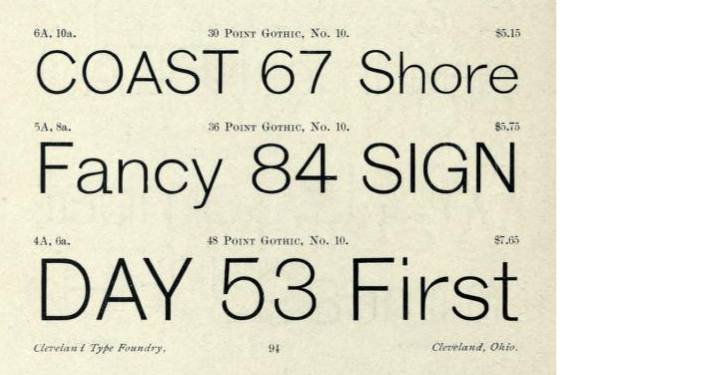

# Banga

_Banga_ is a low contrast sans serif loosely based on the American Type Founders typeface [Gothic No. 10](https://archive.org/details/ATF1893ClevelandSpecimen/mode/2up) distributed by the Cleveland Type Foundry (1893, p111).

## About the Designer

David Sargent is an Australian designer and educator living and working on Jagera and Turrbal land. 

He is Creative Director of [Liveworm](https://liveworm.com.au), a work-integrated learning incubator within the [Queensland College of Art & Design, Griffith University](https://www.griffith.edu.au/arts-education-law/queensland-college-art-design). Liveworm operates as a working design studio for students to engage with a broad range of ‘real world’ projects for not-for-profit, cultural, educational, and small to medium commercial clients. 

As a design practitioner, David is interested in how creative practice can engage, communicate, and spark social change. His studio practice focuses on typography, expressive lettering, and disruptive augmented reality, with creative works exhibited in Australian and international galleries. He releases typefaces under the moniker [Bolt Cutter Type](https://boltcuttertype.com).

## Changelog

**December 2024. Version 0.110**
* Redrawn bolder weight, now less heavy

**December 2024. Version 0.100**
* Initial upload of Roman weights
* Google Fonts Vietnamese Character Set completed
* Google Fonts Latin Core Character Set still in progress

## License

This Font Software is licensed under the SIL Open Font License, Version 1.1.
This license is available with a FAQ at
https://scripts.sil.org/OFL

## Repository Layout

This font repository structure is inspired by [Unified Font Repository v0.3](https://github.com/unified-font-repository/Unified-Font-Repository), modified for the Google Fonts workflow.
